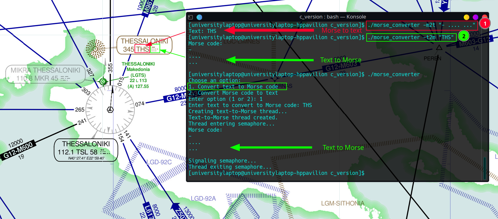
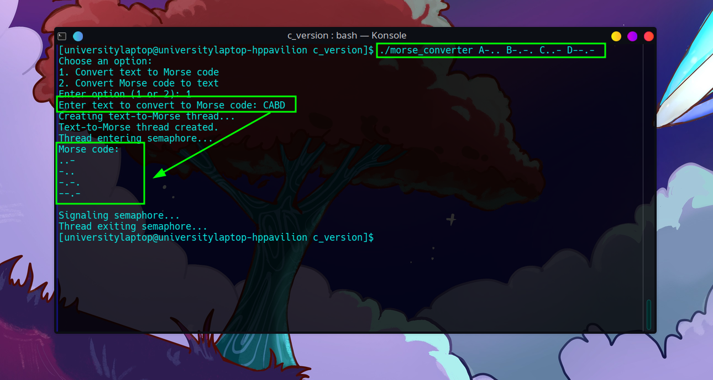

# Morse Code Converter



This is a simple Morse code converter program written in C++. It allows you to convert text to Morse code and vice versa. Additionally, it supports custom Morse code mappings.

## 🛠️ Features

- Convert text to Morse code.
- Convert Morse code to text.
- Support for custom Morse code mappings.

## 📁 Folder Structure (C and C++)
  - 📁 **c_version**
    - 📂 **build**
    - 📁 **src**
      - 📄 main.c
      - 📄 morse.c
      - 📄 morse.h
      - 📄 thread_utils.c
      - 📄 thread_utils.h
    - 📄 Makefile
    - 📄 morse_converter  
  - 📁 **cpp_version**
    - 📂 **build**
    - 📁 **src**
      - 📄 main.cpp
      - 📄 morse.cpp
      - 📄 morse.h
      - 📄 thread_utils.cpp
      - 📄 thread_utils.h
    - 📄 Makefile
    - 📄 morse_converter  


## 📋 Usage

#### <div align="center">Compilation</div>

To compile the program, use the following command:

```bash
g++ -pthread -Wall src/main.cpp src/morse.cpp src/thread_utils.cpp -o morse_converter
```

#### <div align="center">Execution</div>

To run the program, use the following command:

```bash
./morse_converter
```
#### <div align="center">Command-line Arguments</div>

- `-m2t <Morse code>`: Convert Morse code to text.
- `-t2m <Text>`: Convert text to Morse code.

## Examples

#### <div align="center">Using Command-line Arguments</div>

Convert Morse code to text:

```bash
./morse_converter -m2t "- .... ..."
Text: THS
```

Convert text to Morse code:

```bash
./morse_converter -t2m "THS"
Morse code: 
-
....
...
```
#### <div align="center">Without Command-line Arguments</div>
```bash
./morse_converter
Choose an option:
1. Convert text to Morse code
2. Convert Morse code to text
Enter option (1 or 2): 1
Enter text to convert to Morse code: THS
Morse code: 
-
....
...
```

```bash
./morse_converter
Choose an option:
1. Convert text to Morse code
2. Convert Morse code to text
Enter option (1 or 2): 2
Enter Morse code to convert to text: - .... ...
Text: THS
```
#### <div align="center">Choose Custom Mapping Option</div>



```bash
../morse_converter A-.. B-.-. C..- D--.-Choose an option:
1. Convert text to Morse code
2. Convert Morse code to text
Enter option (1 or 2): 1
Enter text to convert to Morse code: ABC
Creating text-to-Morse thread...
Text-to-Morse thread created.
Thread entering semaphore...
Morse code: 
-..
-.-.
..-
```

## Notes

- Make sure to separate Morse code characters with spaces when providing input.

## 📜 License

This project is licensed under the [MIT License](LICENSE).

- [](https://opensource.org/licenses/MIT)